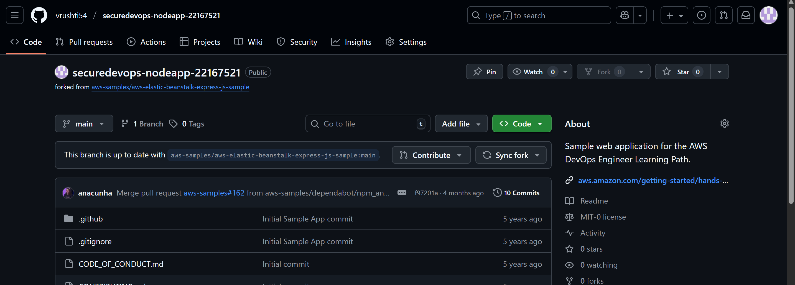
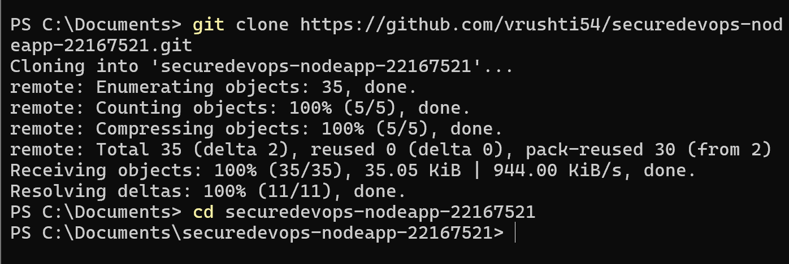
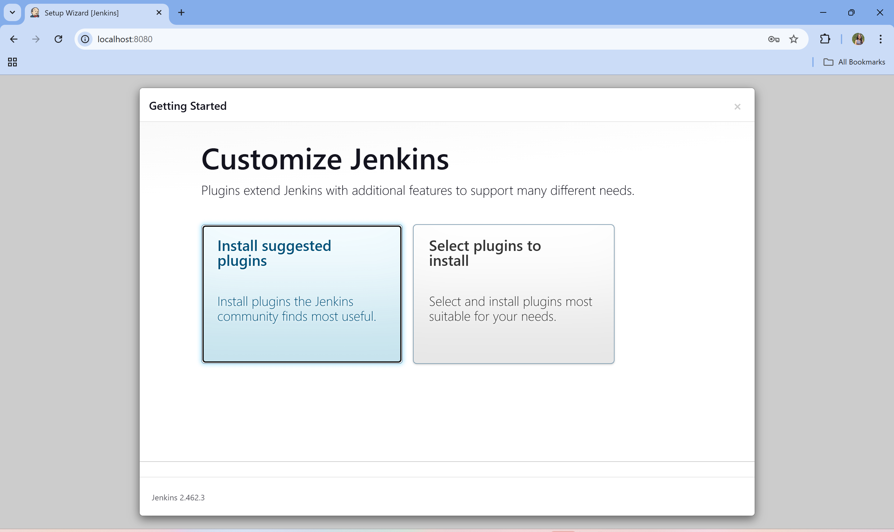
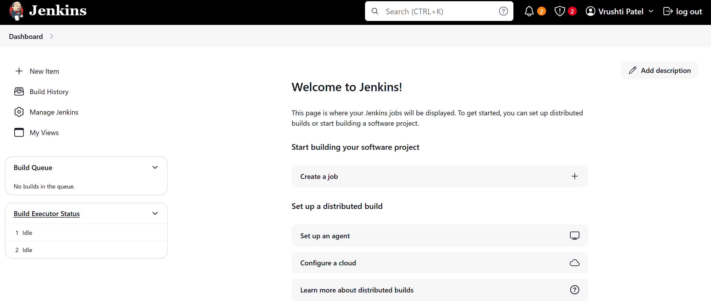
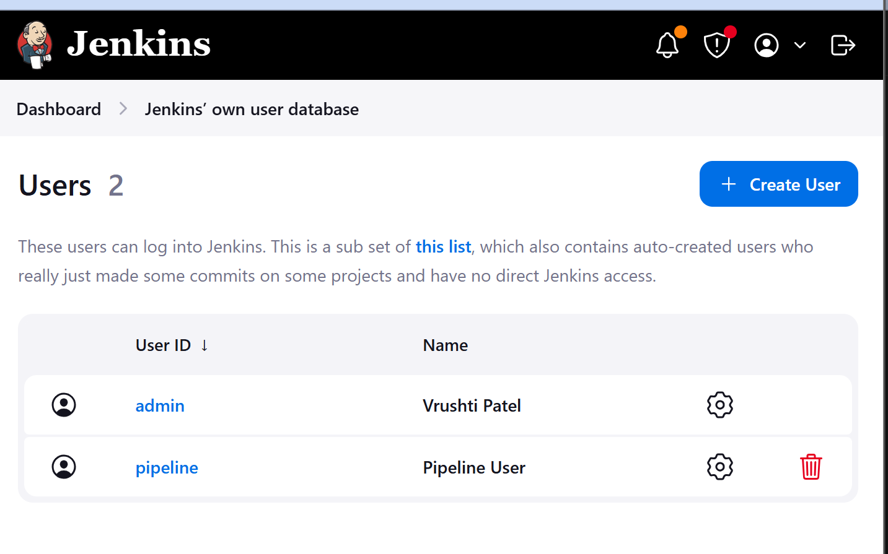
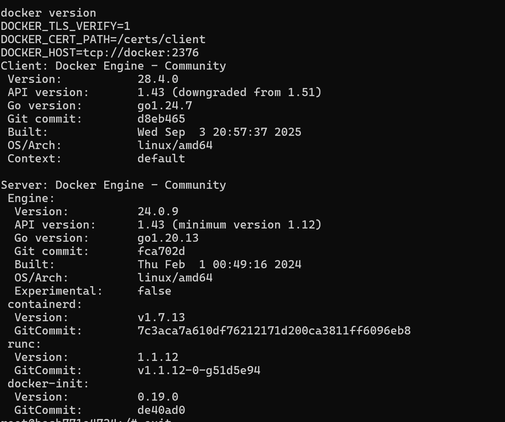
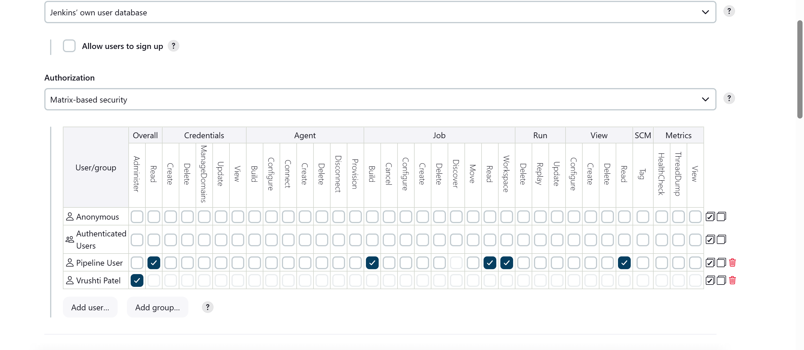

# Assignment 2 – Secure DevOps

## Executive Summary
This project implements a secure DevOps pipeline for a simple Node.js (Express) application. The pipeline is orchestrated using Jenkins and Docker, with integration to Docker Hub for container image distribution. Security is a key focus: Jenkins credentials store is used for secret management, audit and authorization plugins are enabled, and OWASP Dependency-Check provides vulnerability scanning. The outcome is a fully automated CI/CD workflow that ensures reproducibility, traceability, and security compliance.

---

## Table of Contents
1. [Repositories](#1-repositories)  
2. [Jenkins Pipeline](#2-jenkins-pipeline)  
3. [Docker Images](#3-docker-images)  
4. [Security Scanning](#4-security-scanning)  
5. [Local Validation](#5-local-validation)  
6. [Screenshots](#6-screenshots)  
7. [Reflection](#8-reflection)  

---

## 1. Repositories
- **Application repository**: [securedevops-nodeapp-22167521](https://github.com/vrushti54/securedevops-nodeapp-22167521)  
- **Compose/docs repository**: [Project2-Compose-22167521](https://github.com/vrushti54/Project2-Compose-22167521)  
  

These two repositories separate application code from infrastructure and documentation, a best practice in DevOps for clearer separation of concerns.

---

## 2. Jenkins Pipeline
The Jenkins pipeline is defined using a `Jenkinsfile` stored in the GitHub repository.  

- **Mode**: Pipeline from SCM  
- **Credentials**: `docker-hub-creds` for Docker Hub push, `NVD_API_KEY` for OWASP Dependency-Check  
- **Stages**: Clean workspace, checkout, install, test, security scan, build, push to Docker Hub, run container  

This ensures every commit to the main branch can trigger a reproducible build and deployment.

---

## 3. Docker Images
The Node.js app is containerized with Docker. Each Jenkins build generates a unique tagged image (`:BUILD_NUMBER`) and also updates the `:latest` tag.  

- **Image**: `vrushti672/securedevops-nodeapp-22167521:latest`  
- **Proof of push**: (see screenshots)  

This approach ensures both reproducibility (versioned tags) and convenience (latest tag).

---

## 4. Security Scanning
OWASP Dependency-Check is integrated in the pipeline to detect vulnerable dependencies.  

- **Report format**: JSON (archived in Jenkins as build artifacts)  
- **Suppressions file**: `dependency-check-suppressions.xml` for false positives  
- **API key**: Handled securely via Jenkins credentials  

This step demonstrates secure DevOps practices by embedding security scanning directly into the CI/CD lifecycle.

---

## 5. Local Validation
docker run --rm -p 3001:8080 vrushti672/securedevops-nodeapp-22167521:latest
curl -i http://localhost:3001/

- Screenshot: (to be pasted)

## 6. Screenshots

### T1-1 – forked-repo
This screenshot shows the forked repository created from the template, confirming that the project source control setup was initialized correctly.

### T1-2 – clone-success
Demonstrates a successful clone of the forked repository into the local environment, ensuring code can be worked on locally.

### T1-3 – compose-repo-created
Shows creation of the Compose/docs repository, used for managing Jenkins, Docker Compose, and assignment documentation.

### T1-4 – clone-compose-repo
Verifies that the Compose/docs repository was cloned locally, ready for editing and configuration.

### T1-5 – compose-initial-commit
The initial commit pushed to the Compose repository, establishing the base version of configuration and docs.

### T2-1 – compose-up
Illustrates Docker Compose successfully starting Jenkins and DinD containers, validating the infrastructure setup.

### T2-2 – unlock-screen
Confirms access to Jenkins UI and the initial unlock screen, proving Jenkins container was running correctly.

### T2-3 – jenkins-dashboard
Displays Jenkins dashboard after setup, confirming successful installation and accessibility.

### T2-5 – plugins-installed
Shows the installed plugins list, proving Jenkins was configured with required functionality.

### T2-6 – audit-trail
Evidence of the Audit Trail plugin installed and configured for security and traceability.

### T2-7 – pipeline-user
Demonstrates creation of a dedicated Jenkins pipeline user for security best practices.

### T2-8 – matrix-auth
Screenshot of Matrix-based authorization strategy applied, showing role-based access control setup.

### T2-9 – dockerhub-creds
Credentials for Docker Hub configured securely inside Jenkins, avoiding hardcoding secrets in pipelines.

### T2-10 – docker-version-in-jenkins
Verifies Docker CLI version available inside Jenkins, ensuring compatibility with build and push stages.

### T2-matrix-secure
Additional security configuration for user roles, improving Jenkins instance hardening.

### T2-users
Lists users configured in Jenkins, ensuring correct access controls and separation of duties.

### T3-1 – Jenkinsfile-created
Proof that the Jenkinsfile was created locally, defining the CI/CD pipeline stages.

### T3-1 – jenkinsfile-pushed
Evidence of the Jenkinsfile pushed to GitHub, enabling Jenkins Pipeline from SCM.

### T3-2 – dockerfile-pushed
Shows Dockerfile committed and pushed to repository, required for image builds.

### T2-4 – jenkins-dashboard
Final dashboard screenshot after full configuration, confirming the Jenkins environment is ready for pipelines.

## 7. Reflection

This assignment helped me gain practical, hands-on experience in implementing a **secure DevOps pipeline** from scratch. The workflow combined Jenkins, Docker, and security tools to deliver a fully automated CI/CD setup.  

### Key Learnings
- **Jenkins Pipelines**: I learned how to create a `Jenkinsfile` to automate build, test, security scan, and deployment stages.  
- **Docker Integration**: I successfully built Docker images, pushed them to Docker Hub, and validated them locally.  
- **Security Best Practices**: I used Jenkins credentials store for Docker Hub authentication, enabled audit trail logging, and applied matrix-based security for controlled access.  
- **OWASP Dependency-Check**: Integrated a security scanning stage that identifies vulnerabilities early in the CI/CD pipeline.  

### Challenges and Solutions
- **Challenge**: Setting up Jenkins inside Docker-in-Docker (DinD) and ensuring Docker commands ran successfully.  
  **Solution**: Verified Docker version inside the Jenkins container and used proper credentials for Docker Hub.  

- **Challenge**: Ensuring images stayed small and reproducible.  
  **Solution**: Used a `.dockerignore` file and multi-stage builds to optimize image size.  

### Overall Impact
This project showed me how DevOps is not just about automation but also about **building security into every stage of the pipeline**. By combining CI/CD with containerization and security scanning, I now understand how modern development teams can deliver applications that are both reliable and secure.

